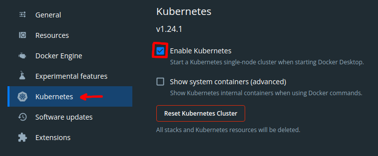

# Instalacion Local Kubernetes con Docker Desktop

1. Dentro de `Docker Desktop`, click sobre `Settings`


2. Activar Kubernetes



3. En caso de tener instalado `kubectl`, seguimos instrucciones:

- Bajar kubectl
```shell
curl -LO "https://dl.k8s.io/release/$(curl -L -s https://dl.k8s.io/release/stable.txt)/bin/linux/amd64/kubectl"
```
- Cambiamos permisos de kubectl y copiamos a /usr/local/bin
```shell
sudo install -o root -g root -m 0755 kubectl /usr/local/bin/kubectl && rm kubectl
```


4. Listado contextos Kubernetes con:
```
kubectl config get-contexts
```

Nos muestra:
```
CURRENT   NAME             CLUSTER          AUTHINFO         NAMESPACE
          Default          local            user             default
          docker-desktop   docker-desktop   docker-desktop   
*         localhost        localhost        localhost        
```


4. Pasar al contexto de kubernetes `docker-desktop`

```
kubectl config use-context docker-desktop
```

5. Listar todos los recursos de todos las namespaces
```
kubectl get all -A
```

```
NAMESPACE     NAME                                         READY   STATUS    RESTARTS       AGE
kube-system   pod/coredns-6d4b75cb6d-88lxd                 1/1     Running   0              2m
kube-system   pod/coredns-6d4b75cb6d-s7cn4                 1/1     Running   0              2m
kube-system   pod/etcd-docker-desktop                      1/1     Running   0              2m
kube-system   pod/kube-apiserver-docker-desktop            1/1     Running   0              2m
kube-system   pod/kube-controller-manager-docker-desktop   1/1     Running   0              2m
kube-system   pod/kube-proxy-jhd5t                         1/1     Running   0              2m
kube-system   pod/kube-scheduler-docker-desktop            1/1     Running   0              2m
kube-system   pod/storage-provisioner                      1/1     Running   0              2m
kube-system   pod/vpnkit-controller                        1/1     Running   0              2m

NAMESPACE     NAME                 TYPE        CLUSTER-IP   EXTERNAL-IP   PORT(S)                  AGE
default       service/kubernetes   ClusterIP   10.96.0.1    <none>        443/TCP                  2m
kube-system   service/kube-dns     ClusterIP   10.96.0.10   <none>        53/UDP,53/TCP,9153/TCP   2m

NAMESPACE     NAME                        DESIRED   CURRENT   READY   UP-TO-DATE   AVAILABLE   NODE SELECTOR            AGE
kube-system   daemonset.apps/kube-proxy   1         1         1       1            1           kubernetes.io/os=linux   2m

NAMESPACE     NAME                      READY   UP-TO-DATE   AVAILABLE   AGE
kube-system   deployment.apps/coredns   2/2     2            2           2m

NAMESPACE     NAME                                 DESIRED   CURRENT   READY   AGE
kube-system   replicaset.apps/coredns-6d4b75cb6d   2         2         2       2m
```